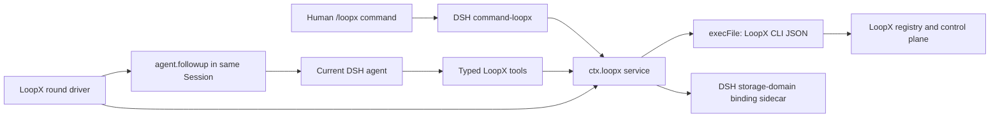

# DeepSeek Harness Native LoopX Plugin Design

**Date:** 2026-08-18

**Status:** Confirmed; awaiting implementation authorization

## Goal and scope

在 `packages/dsh-loopx-plugin/` 提供一套可独立安装的 DeepSeek Harness（DSH）插件，让用户在当前可见 DSH Session 中通过 `/loopx` 启动、接续和观察 LoopX Goal。插件以 LoopX CLI 的 JSON 契约为底层权威，通过 DSH 原生的 command、tool、agent follow-up 与 `storage-domain` 完成 Host 集成，不创建嵌套 DSH 进程，也不调用 `loopx turn run-once`。

最小可交付范围包括：

- 一个新的 LoopX canonical host/agent type `deepseek-harness-native`，以及只指向它的别名 `dsh-native`；
- 一个 Host-plane DSH bundle，提供 `ctx.loopx`、`/loopx`、五个有界模型工具和一个 quota-gated continuation driver；
- 当前 DSH Session 与一个 LoopX `{goal_id, agent_id}` 的显式绑定、暂停、恢复和解绑；
- 通过 DSH `storage-domain` 保存最小 Host binding sidecar，使绑定可冷恢复，但进程重启后默认保持暂停；
- TypeScript 源码、ESM 打包、单元测试，以及不调用真实模型或网络的临时 DSH Profile smoke；
- 本地路径和预构建 tarball 两种 v1 安装方式。

成功标准是：用户运行 `/loopx <goal>` 后，规划和 Todo 写回仍由 LoopX 掌管；激活后，当前 DSH Agent 空闲时只在 `loopx quota should-run` 允许的情况下收到同一 Session 内的 follow-up；普通用户输入会立即暂停自动续跑；只有经过 LoopX 验证的 terminal no-follow-up 才永久停止该绑定。

### Non-goals

- 不替换或改变现有 `deepseek-harness` / `dsh` 外部 adapter，它仍使用 `scripts/dsh_turn_host_adapter.py` 和 `loopx turn run-once`。
- 不新增 `loopx/capabilities/*` capability，也不新增 LoopX extension manifest。
- 不与 DSH `ctx.goals`、`/goal` 或 Goal Driver 读写、同步、迁移或互相推断状态。
- 不复制 LoopX Goal、Todo、claim、quota、status、evidence、terminal 或 heartbeat task body。
- 不提供 Web UI、Client-plane 插件、默认 Agent preset、跨 Session 自动接管、跨 Host 调度或多 Host 并发写支持。
- 不在 v1 发布 npm 包名或 scope；npm registry 发布留待真实分发需求出现后决定。
- 不提交生成的 `lib/`，不把插件私有 sidecar、原始模型内容、CLI 原始输出或本地路径作为公共证据。

## Existing context and verified facts

- `loopx/host_loop_activation.py` 当前将 `deepseek-harness` 规范化为外部 `deepseek_harness_automation_loop`，入口是 `loopx turn run-once` 加 `scripts/dsh_turn_host_adapter.py`；别名 `dsh` 也指向该面。
- `loopx/bootstrap_command_pack.py` 的 `start-goal --guided --format json` 已提供 host surface 选择、`--thread-id`、`--new-peer`、identity selection gate 和只读 guided transaction。返回的 `ordered_steps` 含模型 checkpoint 和命令提示，但仓外插件不应解析或执行其中任意命令字符串。
- `loopx/host_loop_activation.py` 的 Pi 与 OpenCode activation 已验证同类边界：Host 工具负责激活，Host driver 每次续跑前调用 `quota should-run`，LoopX terminal projection 是停止权威。
- `loopx/control_plane/goals/start_contract.py` 要求规划、Todo 写回、refresh、Host activation 和 quota readback 按顺序完成；identity、Todo 和 quota 仍属于 LoopX control plane。
- DSH `agent.followup` 能把 follow-up 注入同一个 Agent/Session；command 和 tool registry 能由 Host bundle 注册。插件产生的消息可使用 `{ kind: "plugin", plugin: "dsh-loopx-plugin" }` source 与普通用户输入区分。
- DSH 仓外插件不能把自定义 required Session event 当作冷恢复真源：已知事件集合由 DSH 仓内源码生成，未知非 ignorable 事件会被 persistence 拒绝，而公开 `Session.append()` 不能为插件事件设置 `ignorable`。
- DSH `@deepseek-ai/dsh-storage-domain` 提供 `defineDomain`、`domainTable`、`DomainFacility.open` 和 `KvTable`。写入按 domain 单进程串行，先持久化、再替换内存并发出进程内 `domain/changed`；它不提供跨进程 CAS、跨表事务或 Session projection。
- DSH `message-feedback` 已提供 Session sidecar 先例：记录以 `SessionId` 为 key，并携带 Session header `{createdAt, cwd}`，生命周期身份不匹配时把旧 row 当作不存在。
- 目标 DSH 基线为 `dsh-v0.1.0-rc.7`。其包使用 ESM、Node `^22.19.0 || >=24`、ES2024、TypeScript 和 tsdown；bundle 通过 `cordis.patch.yml` 安装到 Profile。
- DSH 本地路径安装会把 package spec 交给 pnpm；预构建 tarball 可以避免 Git 安装时 `prepare` 与 pnpm allow-build policy 的额外不确定性。

推论：插件必须同时保留两类绑定信息。LoopX 的 host-thread binding 是 agent identity 的权威读回；DSH sidecar 只是定位该绑定并管理本 Session 的续跑生命周期。两者冲突时，插件不能修补 LoopX 数据，必须暂停并显示冲突。

## Decisions

| Decision | Choice | Rationale |
| --- | --- | --- |
| Capability placement | `capability_id: none`; `provider_id: dsh-loopx-plugin`; `origin: extension`; placement `packages/dsh-loopx-plugin/` | 这是可独立安装的 DSH Host provider，复用现有 LoopX host/session 协议，没有新的 provider-neutral caller contract。 |
| Native host name | canonical `deepseek-harness-native`; alias `dsh-native` | 与现有 `deepseek-harness` / `dsh` 外部 adapter 明确隔离，避免静默改变兼容语义。 |
| Runtime shape | 当前可见 DSH Session 内原生 command/tool/follow-up | 用户能看到并介入同一会话；没有 nested DSH 或 headless turn adapter。 |
| Domain authority | LoopX CLI JSON readback | Goal/Todo/quota/status/terminal 只有一套真源，DSH 不实现第二个 reducer。 |
| Host persistence | DSH `storage-domain` sidecar | 仓外 required Session event 不可冷恢复；sidecar 是 DSH 已验证的 Host-local 持久化边界。 |
| DSH Goal relation | 与 `ctx.goals` 完全无关 | `/goal` 和 `/loopx` 可独立存在；插件不读取或改写另一个 driver 的内部状态。 |
| Cold restore | 恢复绑定，但强制为 paused/disarmed | 保留用户选择，同时避免进程重启后在不可见竞态中静默产生模型调用。 |
| Model surface | 五个 typed tools；不提供任意 argv 工具 | 限制模型权限，常见写回有稳定 schema；高级操作仍可通过既有 shell/CLI 权限完成。 |
| Build and distribution | TS source；tsc + tsdown；本地路径和 prebuilt tarball | 匹配 DSH 工具链，避免手写 `.mjs` 和提交构建产物，推迟 npm 命名决策。 |

## Design

### Naming and compatibility

名称分为三个层次，不能混用：

| Layer | Exact value | Meaning |
| --- | --- | --- |
| `start-goal --host-surface` canonical input and registered agent type | `deepseek-harness-native` | LoopX identity、scheduler profile 和 thread binding 的规范名称 |
| Accepted shorthand | `dsh-native` | 在任何 identity 写入前规范化为 canonical value |
| Activation packet mode | `deepseek_harness_native_session` | 描述由当前 DSH Session 内插件驱动的 Host loop 模式 |

`deepseek-harness`、`deepseek_harness`、`deepseek harness` 和 `dsh` 继续全部规范化到旧的 `deepseek-harness`。任何 alias 都必须在 `bind-agent-thread` 或 thread lookup 前完成规范化，否则同一个 DSH Session 会被拆成两套 LoopX thread identity。

新 surface 使用 `generic_cli` scheduler runtime profile。LoopX activation packet 的 Host owner 是 `DSH LoopX plugin`，入口提示是 `/loopx <task>`，Host tool 是 `loopx_goal_activate`，setup 提示只说明安装 DSH bundle，不接入 `loopx slash-commands --install`。

### Components and ownership

Package 内部按变化原因拆分，而不是创建新的 product capability：

- `cli-client`：二进制解析、argv 构造、process cancellation、输出上限、JSON/schema 校验和错误脱敏。
- `binding` / `schemas`：Host-only row、状态迁移、generation fencing 与 runtime error types。
- `service`：注册 `ctx.loopx`，打开 sidecar domain，串行化每 Session mutation，并组合 CLI readback。
- `command`：注册 `/loopx` 人类控制面。
- `tools`：注册五个模型工具；工具可见性不代表授权，执行时必须解析当前 Agent/Session binding。
- `driver`：监听当前 Agent 的 idle/输入/lifecycle 信号，调用 quota，然后通过 `agent.followup` 续跑。
- `cordis.patch.yml`：只向 Host plane 增加 service、command、tools 和 driver 四个 bundle rows；v1 没有 Client plane row。

Service、command 和 driver 使用同一个 `ctx.loopx` 实例。工具通过 DSH layered/global tool registry 注册，因此 bundle 安装后可见；每次调用仍以当前运行上下文重新解析 Session，未绑定时返回 `LOOPX_SESSION_NOT_BOUND`，不能接受调用者提供的其他 Session id 来绕过边界。

### State authority and sidecar

| State | Authority | Persistence |
| --- | --- | --- |
| Goal、Agent lane、Todo、claim、quota、status、evidence、terminal closure | LoopX | LoopX registry/control-plane storage |
| DSH Session 正在指向哪个 `{goalId, agentId}` | DSH Host binding, validated against LoopX | one `storage-domain` row per DSH `SessionId` |
| pause/armed/uncertain、generation、scheduler reset token、unchanged-poll count、next check time | DSH driver | same sidecar row |
| heartbeat `task_body`、timer handles、AbortController、in-flight probe | LoopX-derived or process-local | memory only; refetch after cache miss/restart |

sidecar domain 使用 versioned Zod schema 和单一 `sessions` table。row 至少包含：

- Session lifecycle identity：`createdAt` 与可选 `cwd`；
- canonical `hostSurface: "deepseek-harness-native"`、`goalId`、`agentId`；
- 解析 LoopX 状态所需的私有 project/registry locator；
- phase：`planning`、`active_paused`、`active_armed` 或 `uncertain`；
- 单调递增 `generation`；
- scheduler reset token、unchanged-poll count、next-check timestamp 和 pause/uncertain reason；
- Host 分配的 `bindingCreatedAt`、`updatedAt`。

不保存 goal text、Todo 内容、status snapshot、quota decision、terminal projection、heartbeat task body、模型消息、工具输出或 CLI stdout/stderr。`/loopx status` 现场读取 sidecar 与 LoopX，并明确分栏展示“DSH binding/driver state”和“LoopX authoritative state”；不能用上次快照伪装实时状态。

每个 mutation 在 service 的 per-Session promise queue 中执行。定时器或异步 probe 捕获 `{session lifecycle identity, goalId, agentId, generation}`；任何 await 后在写 sidecar 或发送 follow-up 前都重新比对。pause、resume、attach、activate、detach 和 Session dispose 都递增或作废 generation。`storage-domain` 的保证只到单进程，多个 DSH Host 同时写同一个 storage root 明确不在 v1 支持范围。

插件初始化时，只有 Session id 与 `{createdAt, cwd}` 都匹配的 row 才可见。冷恢复会保留 goal/agent binding，但把 `active_armed` 重写为 `active_paused`，reason 为 cold restore；用户必须执行 `/loopx resume`。随后 resume 先从 LoopX 重新读回 identity 和 task body，不能使用持久化缓存。

### Human command surface

| Command | Behavior |
| --- | --- |
| `/loopx` | 显示当前 Session 的简洁 status 与可用子命令；没有绑定时不创建 Goal。 |
| `/loopx <goal text>` | `/loopx start <goal text>` 的短形式；开始两阶段 guided start。 |
| `/loopx start <goal text>` | 只在当前 Session 无 binding/pending transaction 时开始新 Goal flow。 |
| `/loopx attach <goal-id> [agent-id]` | 显式绑定并在 readback 成功后 arm；省略 agent 时只复用这个 exact host thread 的既有绑定。 |
| `/loopx attach <goal-id> --new-peer` | 请求 LoopX 创建并绑定一个 fresh agent lane，然后 readback 和 arm。 |
| `/loopx status` | 并列显示 Host binding/driver 与 LoopX authoritative state；只读。 |
| `/loopx pause` | 只暂停当前 DSH Session 的 driver 并取消 timer/in-flight continuation。 |
| `/loopx resume` | 重新校验 LoopX binding、refetch task body、递增 generation，然后 arm。 |
| `/loopx detach` | 只解除当前 Session 的 Host binding；不暂停、关闭或删除 LoopX Goal/Todo。 |

`attach` 不允许猜 agent：若没有 exact thread binding，即使目标 Goal 当前只有一个 agent，也返回 identity selection gate。显式 `[agent-id]` 表示 takeover 意图，`--new-peer` 表示新 lane；两者交给 LoopX 官方 identity/bind contract 执行并读回，插件不直接改 registry 文件。

`detach` 对插件拥有的 exact thread binding 调用 LoopX 官方 unbind contract，再删除 sidecar。任一步结果不确定时进入 `uncertain` 并要求 readback/retry，不能报告已解绑。解绑不触碰 Goal、Todo 或全局 scheduler 状态。

### Two-phase start and activation

第一阶段由人发起，driver 保持 disarmed：

1. `/loopx <goal>` 解析当前 DSH `session.id` 作为 opaque `thread-id`，canonical host 固定为 `deepseek-harness-native`。
2. plugin 以 `--format json --guided --host-surface deepseek-harness-native --thread-id <session-id>` 调用已知的 `start-goal` CLI schema。
3. schema/version、selection gates 和 exact goal/agent identity 通过后，service 写入 `planning` sidecar row。
4. command 把返回的正式 model checkpoint 作为 plugin-owned follow-up 投递到同一 DSH Session。插件只消费已知结构字段，不执行或拆解 `ordered_steps` 中的任意 shell command string。
5. 当前模型按 LoopX guided contract 规划、写 Todo、refresh，并通过既有 shell/CLI 或有界工具完成必要写回。

第二阶段由模型调用 `loopx_goal_activate`：

1. `goalId` 和可选 `agentId` 必须与当前 `planning` row 精确匹配；调用者不能传 registry path、task body 或 Session id。
2. service 从 LoopX 读回 canonical host/thread binding、agent identity、Todo/refresh 后置条件和 activation packet。缺失、冲突或 schema 不支持时保持 disarmed。
3. service 用自己构造的已知 argv 获取 heartbeat JSON；不执行 activation packet 返回的 command text。
4. task body 只放入当前进程内存，sidecar 切换为 `active_armed` 并递增 generation。
5. driver 只有在 Agent idle 后才执行第一次 quota probe；activation 本身不直接制造额外模型 turn。

人类 `/loopx attach` 是显式的直接绑定路径，不重放规划 checkpoint。它完成 LoopX identity selection/bind/readback 后获取 task body 并 arm。

### Typed model tools

v1 只注册以下工具：

- `loopx_goal_activate`：只接受 pending `goalId` 和可选 exact `agentId`。
- `loopx_status`：从当前 binding 读取 LoopX status；不接受 alternate goal/session identity。
- `loopx_todo_claim`：接受 `todoId` 和可选 role；goal/agent/claim owner 从 binding 派生。
- `loopx_todo_update`：接受 `todoId` 与 LoopX 已有 contract 的稳定小子集，如 status、note、evidence、reason、task class 或 clear-claim。
- `loopx_todo_complete`：接受 `todoId`、完成 evidence/note、no-follow-up 与 LoopX 要求的 turn/lease identity 字段。

这些工具不是 LoopX CLI 的完整镜像，也不提供 `loopx_cli(argv)`。Todo 创建、successor/replan、复杂 evidence 和其他高级操作继续使用普通 LoopX CLI；是否能使用 shell 由 DSH preset/部署本身决定，安装插件不会额外授予 shell、文件、网络、凭据或生产权限。

所有 tool result 使用稳定的 success/error envelope。未绑定固定返回 `LOOPX_SESSION_NOT_BOUND`。identity、schema、permission 或 uncertain-write 冲突返回可操作的 typed failure，同时 pause driver；不能通过宽泛 catch 或字符串匹配把失败降级为成功。

### Continuation driver

driver 只在 `active_armed` 且当前 Agent idle 时运行：

1. 捕获 binding generation 和 Session lifecycle identity。
2. 以唯一 turn instance identity 调用 `loopx quota should-run --runtime-profile generic_cli --include-detail scheduler --format json`。
3. 校验 quota schema、agent/goal identity 和 scheduler detail。
4. `should_run` / `run_now` 时，重新获取或确认内存 task body，通过 `agent.followup` 向同一 Agent 发送一次 plugin-owned message。
5. 非 terminal 且暂不运行时，按 LoopX `scheduler_hint` 保存 reset token/unchanged-poll count 并设置下一次 timer；缺少有效 hint 时使用与现有 Pi runtime 一致的三分钟 fail-closed retry。
6. 只有完整验证过的 `terminal_no_followup`、derived closure 和 user/agent Todo source completeness 才停止，并把 Host phase 设为 `active_paused`、reason 设为 `loopx_terminal_observed`；真正的 terminal state 仍在 status 时从 LoopX 重读。普通 `should_run: false` 不是终止证明。

同一 generation 最多一个 quota evaluation、一个 timer 和一个 follow-up in flight。quota read 可在同一 turn identity 下有界重试；写操作除非 LoopX contract 明确幂等，否则不自动重试。若子进程超时或输出截断导致 write outcome 不确定，binding 转 `uncertain`，driver disarm，必须先 readback。

任何不是当前插件、当前 generation 自己生成的输入都视为 foreign input，包括普通用户消息、其他插件消息和 `/goal` driver 产生的消息。foreign input 立即 pause 并取消 pending timer；插件不读取 `ctx.goals` 来判断另一个 driver 状态。因此同一 Session 同时自动运行 `/goal` 与 `/loopx` 明确不受支持，但两套状态本身仍完全独立。

Session/Agent dispose 或 binding replacement 只作废对应 Session 的 generation，abort 它的 CLI child 并清除它的 timer；不能影响其他 Session。只有 bundle/service dispose 才关闭全局 mutation admission、abort 全部 CLI children、清除全部 timers、等待已接纳的 per-Session queues，再关闭 storage domain。过期 callback 在每个 await 后都必须通过 epoch/generation guard，不能向新 binding 发送旧 task body。

### CLI process and schema boundary

- binary resolution order：插件 config 的显式路径、`LOOPX_BIN`、最后是 `PATH` 中的 `loopx`；status 显示采用了哪一层，但错误输出不泄漏敏感 locator。
- 只使用 Node `execFile`/spawn argv array，绝不通过 shell、字符串拼接或返回的 command text 执行。
- 所有被消费的命令都请求 `--format json`，验证顶层 schema version 以及实际读取的 nested fields；允许未知 additive fields，拒绝缺失、错型或不支持的 major/version。
- read 和 write 使用分开的有限 timeout，stdout/stderr 各有 byte cap，并接入 DSH lifecycle AbortSignal。具体数值作为 package config 中单点定义的保守默认值，README 与边界测试必须一致。
- 日志只记录 operation、schema/code、duration 和脱敏后的 identity；不记录 task body、goal text、Todo evidence、完整 argv、环境变量、原始 stdout/stderr 或绝对 locator。
- 只把 `LOOPX_BIN` 和显式所需环境传给子进程；插件不会管理 DSH/LoopX 凭据。

### Packaging, installation, and removal

源码位于 `src/**/*.ts`，package 使用 `"type": "module"`、与 DSH 一致的 Node engines 和 ES2024 target。`tsc` 负责 typecheck/declarations，tsdown 生成多入口 ESM `lib/*.js`；exports 至少覆盖 service、command、tools 和 driver。`lib/` 被忽略且不提交。

`prepack` 必须执行干净 build，tarball 只包含运行时 `lib/`、types、`cordis.patch.yml`、package metadata 和必要 README/license。`prepare` 可以服务 Git install，但不是 v1 canonical 路径。

v1 runbook：

1. 本地路径：在 package 目录安装依赖并 build，然后运行 `dsh plugin --profile web add <package-path>`。
2. tarball：运行 `pnpm pack`，然后 `dsh plugin --profile web add <tarball-path>`。
3. readback：运行 `dsh --profile web --dump-config`，确认四个 Host rows 与 storage-domain backend 已解析。
4. remove：运行 `dsh plugin --profile web remove dsh-loopx-plugin`。

remove 只卸载 bundle layer，不删除 LoopX state。v1 也不隐式清空 storage-domain sidecar；数据 purge 是独立、显式且可审计的未来操作。插件重装后仍须经过 lifecycle identity 检查和冷恢复 paused gate。

### Security, privacy, and failure behavior

- 安装和工具可见性只增加接口，不增加 DSH Agent 的文件、shell、网络、credential 或 production authority。
- 所有 mutation 都绑定当前 DSH Session 和 LoopX exact agent lane；模型不能指定另一个 Session、registry 或 arbitrary argv。
- Host binding conflict 时 LoopX readback 胜出，但插件不会静默覆盖 sidecar；它进入 paused/uncertain 并显示修复命令或 selection gate。
- sidecar 属于本机 Host private state，不进入 Session event、model prompt、公共 evidence 或 telemetry。
- 多 Host 进程共享 storage root、跨机器调度和恶意本地调用者授权不在 v1 威胁模型内；部署仍须保护 DSH Host gateway 与本地存储。

## Testing and acceptance

### LoopX contract tests

- `deepseek-harness-native` 出现在 guided host choices、agent catalog、scheduler runtime mapping 和 activation contract 中。
- `dsh-native` 在任何 thread binding 前规范化到 canonical value。
- `deepseek-harness` 与 `dsh` 的现有 external adapter packet、setup 和 entry 不发生行为变化。
- native activation packet 使用 Host tool、当前-session semantics 和 JSON activation input；不声称 CLI 能直接变更 DSH Host。
- ambiguous/unbound agent selection、`--new-peer` 和 exact thread identity 保持现有 fail-closed contract。

### TypeScript unit and race tests

- CLI client 使用 argv array，覆盖 binary precedence、timeout、abort、output cap、redaction、schema mismatch、additive fields 和 uncertain write。
- storage-domain row 覆盖 lifecycle identity mismatch、cold restore disarm、whole-row replacement、generation increment、single-process mutation serialization 和 disposal drain。
- command 覆盖 start selection gate、two-phase pending/activate、attach identity gate、pause/resume/detach 和双栏 status。
- tools 覆盖 current-session derivation、`LOOPX_SESSION_NOT_BOUND`、alternate identity rejection、稳定字段映射与高级 argv 拒绝。
- driver 覆盖 idle→quota→follow-up、quiet wait、validated terminal、foreign input pause、同 generation 去重、stale timer/probe fencing、Session dispose、bundle reload 和 task-body refetch。
- `ctx.goals` 不出现在 imports、injects、runtime reads/writes 或 migration code 中。

### Build and profile smoke

- `pnpm typecheck`、unit tests、`pnpm build` 和 `pnpm pack` 通过；tarball manifest 不包含源码外的私有状态、`lib/` 以外的生成垃圾或本地路径。
- 在临时 DSH Profile 中安装 package path 与 tarball，使用 mock LoopX executable 返回固定 JSON；验证 config readback、`/loopx status`、activation、一次 idle continuation、foreign input pause 和 remove。
- smoke 不启动真实模型、不访问网络、不需要凭据、不写用户现有 DSH Profile，也不把临时目录写入仓库。
- 集成完成后运行受影响的 Python tests、package 全量 tests、`git diff --check`，以及合并前的 `loopx canary premerge --from-git-diff` 风险验证。

## Implementation plan

任务只有在其 direct dependencies 已通过各自 validation 后才能开始。T3 与 T4 可并行，但必须以 T2 已冻结的 service/types contract 为共同输入，并保持写集分离。

### Task dependencies

| ID | Task | Direct dependencies | Parallel with | Handoff |
| --- | --- | --- | --- | --- |
| T1 | Add the LoopX native host contract | — | — | Canonical host, activation packet and Python contract tests |
| T2 | Build the DSH CLI and binding service core | T1 | — | Stable `ctx.loopx` service, sidecar schema and process boundary |
| T3 | Add human commands and typed model tools | T2 | T4 | Complete bounded control surfaces over the service |
| T4 | Add quota-gated same-session continuation | T2 | T3 | Race-safe driver with deterministic tests |
| T5 | Assemble, document and smoke the installable bundle | T1, T3, T4 | — | Packable DSH plugin and end-to-end acceptance evidence |

### T1: Add the LoopX native host contract

**Goal:** 让 LoopX CLI 能明确返回 DSH native activation，而不改变现有 DSH external adapter。

**Depends on / mode:** 无；本任务先冻结 canonical naming、JSON packet 和 identity semantics，后续 package 只能消费该 contract。

**Files:**

- Modify: `loopx/host_loop_activation.py` — agent catalog、alias normalization、scheduler profile 和 native activation packet。
- Modify: `loopx/bootstrap_command_pack.py` — guided host choice、description 和 canonical input。
- Modify: `loopx/control_plane/goals/start_contract.py` — native Host activation description。
- Modify: `loopx/agent_onboarding.py` — native type discovery/readback，保留 external setup。
- Modify: `loopx/slash_command_install.py` — 只更新通用 host choice/help；不实现 DSH package installer。
- Modify: `tests/test_host_loop_activation.py` — canonical/alias/new packet 与 external regression。
- Modify: `tests/control_plane/test_start_goal_compact_projection.py` — guided JSON 和 thread identity acceptance。
- Create: `tests/test_agent_onboarding_dsh_native_host.py` — native onboarding contract。
- Modify: `tests/test_slash_command_install.py` — host help regression（仅在生产 help 改动需要时）。
- Do not touch: `scripts/dsh_turn_host_adapter.py` 和其 external runtime behavior。

**Changes:**

- 在写入/查找 thread binding 前统一 canonicalize `dsh-native`。
- 返回 `deepseek_harness_native_session` packet，Host tool 为 `loopx_goal_activate`，scheduler 为 `generic_cli`，setup 指向独立 DSH package。
- activation tool mapping 不暴露 task body、registry path 或 arbitrary command；这些由插件 readback 派生。
- 为旧 `deepseek-harness` / `dsh` packet 做完整负向回归，防止 alias 被迁移到 native。

**Handoff:** 一套由 Python tests 固定的 native Host JSON 契约，T2 可据此实现严格 schema consumer。

**Done when / validation:** `python -m pytest tests/test_host_loop_activation.py tests/control_plane/test_start_goal_compact_projection.py tests/test_agent_onboarding_dsh_native_host.py tests/test_slash_command_install.py` 通过，且 external DSH fixtures 无 diff。

### T2: Build the DSH CLI and binding service core

**Goal:** 建立 package 的安全 CLI process boundary、Host-only sidecar 与 `ctx.loopx` service，不注册用户/模型入口或自动续跑。

**Depends on / mode:** T1；必须以已通过测试的 schema 与 canonical host 为准。

**Files:**

- Create: `packages/dsh-loopx-plugin/package.json` — package identity、engines、scripts 和 development dependencies。
- Create: `packages/dsh-loopx-plugin/tsconfig.json` — ES2024/Node ESM strict TS configuration。
- Create: `packages/dsh-loopx-plugin/src/types.ts` — public service request/result types。
- Create: `packages/dsh-loopx-plugin/src/schemas.ts` — CLI JSON 与 storage-domain Zod schemas。
- Create: `packages/dsh-loopx-plugin/src/errors.ts` — stable typed failures and redaction helpers。
- Create: `packages/dsh-loopx-plugin/src/cli-client.ts` — `execFile` argv, timeout/cap/abort and schema validation。
- Create: `packages/dsh-loopx-plugin/src/binding.ts` — lifecycle states、generation transitions and immutable snapshots。
- Create: `packages/dsh-loopx-plugin/src/service.ts` — `ctx.loopx`、storage domain、per-Session queues and readback composition。
- Create: `packages/dsh-loopx-plugin/src/index.ts` — service export/metadata only。
- Create: `packages/dsh-loopx-plugin/tests/cli-client.spec.ts` — process/schema boundary。
- Create: `packages/dsh-loopx-plugin/tests/service.spec.ts` — sidecar, identity and lifecycle tests with fake CLI。
- Do not touch: command/tool/driver entry files owned by T3/T4；不创建 custom Session event。

**Changes:**

- 用一个 versioned `sessions` table whole row 实现 lifecycle-bound binding；不创建 JSON/SQLite 私有后端，直接 inject DSH `storageDomain`。
- 以 LoopX readback 验证每个 binding；冲突、未知 write outcome 和冷恢复均 disarm。
- task body 只在内存 cache 中存在；service 提供按 generation 获取/刷新它的有界方法。
- 关闭时停止 admission、drain queues、abort children，再关闭 domain。

**Handoff:** 稳定、可 fake 的 `ctx.loopx` contract；T3/T4 不需要直接理解 CLI stdout 或 storage backend。

**Done when / validation:** package focused typecheck 与 `pnpm test -- cli-client.spec.ts service.spec.ts` 通过；测试证明无 shell execution、无 raw prompt persistence、无 stale lifecycle reuse。

### T3: Add human commands and typed model tools

**Goal:** 在当前 Session 提供确认过的 `/loopx` 控制面和五个最小模型工具。

**Depends on / mode:** T2；可与 T4 并行。只调用 T2 service，不修改 driver internals。

**Files:**

- Create: `packages/dsh-loopx-plugin/src/command.ts` — `/loopx` parser and command handlers。
- Create: `packages/dsh-loopx-plugin/src/tools.ts` — five typed DSH tool registrations。
- Create: `packages/dsh-loopx-plugin/tests/command-tools.spec.ts` — command/tool behavior and authority tests。
- Do not touch: `src/driver.ts`、`tests/driver.spec.ts`、DSH `ctx.goals` packages。

**Changes:**

- 实现 start/attach/status/pause/resume/detach 和 two-phase guided checkpoint delivery。
- 保留 selection gate，不从 Goal agent count 猜 identity；attach 显式 arm，cold restore 仍要求 resume。
- 所有工具从当前 execution context 派生 Session 与 binding，拒绝 alternate identity 和 arbitrary argv。
- status 同时读取 Host 与 LoopX，但清楚标注 authority；控制命令不改变 Goal/Todo/global scheduler。

**Handoff:** 可由 bundle 注册的 command/tool modules，带有独立 fake-service tests。

**Done when / validation:** `pnpm test -- command-tools.spec.ts` 与 focused typecheck 通过；unbound、selection、takeover/new-peer、uncertain write 和 detach failure 都有负向覆盖。

### T4: Add quota-gated same-session continuation

**Goal:** 用 DSH idle/follow-up primitives 实现唯一、可中断、由 LoopX quota 决定的当前 Session 续跑。

**Depends on / mode:** T2；可与 T3 并行。只消费冻结的 service types，不改 command/tool files。

**Files:**

- Create: `packages/dsh-loopx-plugin/src/driver.ts` — lifecycle listeners、quota evaluation、scheduler timer and follow-up injection。
- Create: `packages/dsh-loopx-plugin/tests/driver.spec.ts` — deterministic fake-clock/race suite。
- Do not touch: `src/command.ts`、`src/tools.ts`、`ctx.goals` 或 LoopX quota reducer。

**Changes:**

- 对每个 Session 保持至多一个 evaluation/timer/follow-up，并以 epoch + generation 在每个 await 后 fencing。
- 只在 idle + armed 时 probe；根据 LoopX scheduler hint wait，只有 validated terminal closure 停止。
- foreign input、pause、detach、dispose、reload 或 uncertain result 都立即取消 continuation。
- retry 复用同一 turn identity；写操作不做未经 contract 允许的自动重试。

**Handoff:** 可独立装配的 Host driver，其竞态和终止语义由 deterministic tests 固定。

**Done when / validation:** `pnpm test -- driver.spec.ts` 通过；fake clock 覆盖 stale callback、mid-await rebind、double-idle、user preemption、terminal completeness 和 shutdown drain。

### T5: Assemble, document and smoke the installable bundle

**Goal:** 把已验证模块组装成可通过 local path/tarball 安装的 DSH Profile bundle，并完成公共 runbook 与端到端 smoke。

**Depends on / mode:** T1、T3、T4；只能在三者 validation 通过后收敛集成。

**Files:**

- Create: `packages/dsh-loopx-plugin/tsdown.config.ts` — multi-entry ESM/declaration build。
- Create: `packages/dsh-loopx-plugin/cordis.patch.yml` — four Host-plane bundle rows。
- Create: `packages/dsh-loopx-plugin/pnpm-lock.yaml` — reproducible package dependencies。
- Modify: `packages/dsh-loopx-plugin/package.json` — final exports、files、build/prepack scripts and DSH bundle manifest。
- Create: `packages/dsh-loopx-plugin/README.md` — install/config/use/status/pause/remove/privacy/limitations。
- Create: `packages/dsh-loopx-plugin/smoke/dsh-profile-smoke.mjs` — temporary Profile plus mock LoopX CLI acceptance。
- Create: `docs/integrations/deepseek-harness-native-plugin.md` — canonical LoopX integration guide。
- Modify: `docs/integrations/deepseek-harness-connector.md` — distinguish and cross-link existing external path。
- Modify: `docs/integrations/runtime-connector-catalog.md` — list both surfaces without changing old semantics。
- Do not touch: root README hero/CTA、npm publication configuration、generated `lib/`。

**Changes:**

- bundle 以 service → command/tools/driver 的依赖顺序装配，并验证 storage-domain backend 缺失时 fail loud/pending，而不是退回 memory-only。
- pack 后从 tarball contents 验证只有允许文件；local path 与 tarball 都在临时 Profile readback。
- README 给出精确 activation、readback、pause/detach、remove 和 sidecar retention 说明；在最终提交其首屏前执行仓库要求的 owner preview gate。
- 文档明确 `dsh` 是 external、`dsh-native` 是 same-session plugin，不把两者表述成迁移关系。

**Handoff:** 一个可安装、可移除、文档齐全且在无模型/无网络环境通过 smoke 的 v1 package。

**Done when / validation:** Python focused suite、package `pnpm typecheck`/tests/build/pack、两种临时 Profile smoke、public/private scan、`git diff --check` 和 `loopx canary premerge --from-git-diff` 全部完成；任何 skip 或 manual hold 在评审证据中明确列出。

### Plan self-check

- 依赖图无环且只列 direct dependencies；T3/T4 只在 T2 contract 稳定并通过验证后并行。
- T3 与 T4 写集分离，共享读取 T2 types/service，通过 T5 统一装配。
- canonical naming、single source of truth、storage sidecar、`ctx.goals` 隔离、两阶段激活、driver 终止语义、build/install 与 non-goals 都有明确任务 owner。
- 每个任务都有 reviewable handoff、负向测试和与风险相称的 validation。
- 计划没有实现代码 dump、TDD 微步骤、commit choreography 或未被当前 v1 调用的未来抽象。
